# 🌿 Faces of Plants

> *Powered by GBIF - Democratizing access to global biodiversity data*

A modern, intelligent platform that bridges the gap between complex biodiversity databases and everyday users. **Faces of Plants** transforms natural language queries into GBIF (Global Biodiversity Information Facility) API calls, making plant biodiversity data accessible to both citizen scientists and researchers.

[](https://sst.dev)
[](https://nextjs.org)
[](https://typescriptlang.org)
[](https://aws.amazon.com)

---

## ⚠️ Manual AWS Steps for Custom Domains

- **CloudFront (Next.js site):**
  - ACM certificate for your domain (e.g. `facesofplants.org`) **must be in us-east-1 (N. Virginia)**.
  - Attach the certificate to your CloudFront distribution in the AWS Console.
  - In Route53, create an **A record (Alias)** for your domain pointing to the CloudFront distribution.
- **API Gateway:**
  - ACM certificate must be in the same region as your API (eu-central-1/Frankfurt).
  - Attach the certificate to your API Gateway custom domain.

---

## 🔑 Secret Management

- **Never store secrets in `.env` for Lambda!** Use SST secrets:
  - Set secrets for each stage:
    ```sh
    sst secret set LLM_API_KEY "your-api-key" --stage dev
    sst secret set LLM_API_KEY "your-api-key" --stage production
    ```
  - Lambda functions will automatically receive secrets as environment variables.
  - `.env.local` is only for local development.

---

## 📋 Table of Contents

- [🎯 Project Vision](#-project-vision)
- [⚡ Quick Start](#-quick-start)
- [🏗️ Architecture](#️-architecture)
- [📊 Project Status](#-project-status)
- [🚀 Features](#-features)
- [🛠️ Technology Stack](#️-technology-stack)
- [📁 Project Structure](#-project-structure)
- [🔧 Development](#-development)
- [🌐 Deployment](#-deployment)
- [🔍 API Reference](#-api-reference)
- [🤝 Contributing](#-contributing)

## 🎯 Project Vision

**Faces of Plants** democratizes access to the world's largest biodiversity database by:

- **🗣️ Natural Language Interface**: Query plant data using everyday language
- **👥 Dual User Experience**: Tailored interfaces for citizen scientists and researchers
- **🌍 Global Coverage**: Access to millions of plant occurrence records worldwide
- **🤖 AI-Powered**: Intelligent query translation and result interpretation
- **📱 Modern UX**: Beautiful, responsive interface built with modern web technologies

## ⚡ Quick Start

### Prerequisites

- **Node.js** 18+ and **pnpm**
- **AWS CLI** configured with appropriate credentials
- **OpenAI API Key** (for LLM-powered query translation)

### 1. Clone & Install

```bash
git clone https://github.com/juserr/faces-of-plants.git
cd faces-of-plants
pnpm install
```

### 2. Environment Setup

```bash
# Set your OpenAI API key
export LLM_API_KEY="your-openai-api-key-here"
```

### 3. Development Mode

```bash
# Start SST development environment
pnpm run dev

# In another terminal, start the web interface
cd packages/web
pnpm run dev
```

### 4. Production Deployment

```bash
# Deploy to AWS
pnpm run deploy --stage production

# Set production secrets
sst secret set LLM_API_KEY "your-api-key" --stage production
```

🌐 **Access your app**: SST will provide URLs for both API and web interface after deployment.

## 🏗️ Architecture

### System Overview

```mermaid
graph TB
    UI[Next.js Frontend] --> API[API Gateway]
    API --> Query[Query Handler λ]
    API --> Species[Species Handler λ]
    API --> Collections[Collections Handler λ]
    
    Query --> LLM[OpenAI/LLM Service]
    Query --> GBIF[GBIF API]
    Query --> DDB1[(User Collections)]
    Query --> DDB2[(Query History)]
    
    Species --> GBIF
    Collections --> DDB1
    Collections --> DDB2
    
    style UI fill:#e1f5fe
    style API fill:#f3e5f5
    style GBIF fill:#e8f5e8
    style LLM fill:#fff3e0
    style DDB1 fill:#fce4ec
    style DDB2 fill:#fce4ec
```



### Key Components

#### 🎨 **Frontend Layer** (`packages/web`)
- **Framework**: Next.js 14 with App Router
- **Styling**: Tailwind CSS with Lucide icons
- **Features**: 
  - Responsive design for mobile and desktop
  - Real-time search with loading states
  - User type selection (Citizen vs Researcher)
  - Interactive species result display

#### ⚡ **Serverless API** (`packages/functions`)
- **Runtime**: Node.js 18 on AWS Lambda
- **Gateway**: API Gateway V2 with HTTP API
- **Endpoints**:
  - `POST /query` - Natural language plant queries
  - `GET /species/{id}` - Detailed species information
  - `POST /collections` - Save search collections
  - `GET /collections/{userId}` - Retrieve user collections

#### 🧠 **Intelligence Layer**
- **LLM Integration**: OpenAI API for query translation
- **GBIF Client**: Custom TypeScript client for GBIF API
- **Query Processing**: Natural language → Structured GBIF parameters

#### 🗄️ **Data Layer**
- **Primary Data**: GBIF API (Read-only)
- **User Data**: DynamoDB tables
  - `FacesOfPlantsUserCollections` - User-saved plant collections
  - `FacesOfPlantsQueryHistory` - Search history and analytics

#### 🏗️ **Infrastructure** (`sst.config.ts`)
- **Framework**: SST v3 (Serverless Stack Toolkit)
- **Cloud**: AWS with eu-central-1 region
- **Resources**: Lambda, DynamoDB, API Gateway, CloudFront, S3

## 📊 Project Status

### 🟢 Completed Features

- ✅ **Core Infrastructure**: SST configuration and AWS setup
- ✅ **Frontend Foundation**: Next.js app with landing page
- ✅ **API Skeleton**: Lambda functions with proper routing
- ✅ **GBIF Integration**: Client library for GBIF API access
- ✅ **Type Safety**: Comprehensive TypeScript definitions
- ✅ **Mock Data**: Working prototype with sample responses

### 🟡 In Development

- 🔄 **LLM Integration**: OpenAI API for query translation
- 🔄 **Species Detail Views**: Rich species information pages
- 🔄 **User Collections**: Save and manage plant discoveries
- 🔄 **Search Refinement**: Advanced filtering and sorting

### 🔴 Planned Features

- 📋 **User Authentication**: Account system with AWS Cognito
- 📊 **Analytics Dashboard**: Search trends and popular species
- 🗺️ **Interactive Maps**: Geospatial visualization of occurrences
- 📱 **Mobile App**: React Native companion app
- 🔍 **Advanced Search**: Expert search interface for researchers
- 📈 **Data Visualization**: Charts and graphs for occurrence data

### Current Implementation Status

| Component | Status | Notes |
|-----------|--------|-------|
| Frontend UI | 🟢 Complete | Modern, responsive design |
| API Infrastructure | 🟢 Complete | All endpoints defined and deployed |
| GBIF Integration | 🟢 Complete | Full API client implementation |
| LLM Query Translation | 🟡 Partial | Function stubs ready, needs API integration |
| Database Schema | 🟢 Complete | DynamoDB tables configured |
| User Collections | 🟡 Partial | Backend ready, frontend in progress |
| Authentication | 🔴 Planned | Not yet implemented |
| Testing Suite | 🔴 Planned | Unit and integration tests needed |

## 🚀 Features

### For Citizen Scientists 👥

- **Simple Search**: "Show me oak trees in Central Park"
- **Visual Results**: Beautiful species cards with photos
- **Location Awareness**: Find plants near you
- **Learn & Explore**: Discover new species with guided information

### For Researchers 🔬

- **Advanced Queries**: Complex scientific searches
- **Bulk Data Access**: High-limit result sets
- **Export Capabilities**: Download data for analysis
- **Precise Filtering**: Taxonomic, geographic, and temporal filters

### Core Functionality 🌟

- **Natural Language Processing**: Convert plain English to GBIF queries
- **Real-time Search**: Instant results from GBIF's 1.5+ billion records
- **Global Coverage**: Plant data from every continent
- **Quality Filtering**: Automatic data quality checks
- **Responsive Design**: Perfect on phone, tablet, and desktop

## 🛠️ Technology Stack

### Frontend
- **Next.js 14** - React framework with App Router
- **TypeScript** - Type safety and developer experience
- **Tailwind CSS** - Utility-first styling
- **Lucide React** - Beautiful, consistent icons

### Backend
- **SST v3** - Serverless Stack Toolkit
- **AWS Lambda** - Serverless compute
- **API Gateway V2** - HTTP API management
- **DynamoDB** - NoSQL database
- **AWS Secrets Manager** - Secure credential storage

### External Services
- **GBIF API** - Global biodiversity data
- **OpenAI API** - Natural language processing
- **AWS CloudFront** - Global content delivery

### Development Tools
- **pnpm** - Fast, efficient package manager
- **TypeScript** - Static type checking
- **ESLint** - Code linting and quality
- **Prettier** - Code formatting

## 📁 Project Structure

```
faces-of-plants/
├── 📄 sst.config.ts                    # SST infrastructure configuration
├── 📄 package.json                     # Root workspace configuration
├── 📄 pnpm-workspace.yaml             # pnpm workspace setup
├── 📄 tsconfig.json                   # TypeScript configuration
├── 
├── 📁 packages/
│   ├── 📁 core/                       # Shared types and utilities
│   │   ├── 📄 package.json
│   │   └── 📁 src/
│   │       └── 📄 types.ts            # TypeScript type definitions
│   │
│   ├── 📁 functions/                  # AWS Lambda functions
│   │   ├── 📄 package.json
│   │   ├── 📁 api/
│   │   │   ├── 📄 query.ts           # Natural language query handler
│   │   │   ├── 📄 species.ts         # Species detail handler
│   │   │   └── 📄 collections.ts     # User collections handler
│   │   ├── 📁 gbif/
│   │   │   └── 📄 client.ts          # GBIF API client
│   │   └── 📁 llm/
│   │       └── 📄 proxy.ts           # OpenAI API integration
│   │
│   └── 📁 web/                       # Next.js frontend application
│       ├── 📄 package.json
│       ├── 📄 next.config.ts
│       ├── 📄 tailwind.config.js
│       └── 📁 src/
│           ├── 📁 app/
│           │   ├── 📄 page.tsx       # Landing page
│           │   ├── 📄 layout.tsx     # App layout
│           │   └── 📁 api/
│           │       └── 📁 query/
│           │           └── 📄 route.ts # Development API route
│           └── 📁 components/
│               └── 📄 landing-page.tsx # Main landing page component
│
└── 📁 stacks/                        # SST stack definitions (if using)
    ├── 📄 ApiStack.ts
    ├── 📄 DatabaseStack.ts
    └── 📄 FrontendStack.ts
```

## 🔧 Development

### Local Development Setup

1. **Clone the repository**
```bash
git clone <your-repo-url>
cd faces-of-plants
```

2. **Install dependencies**
```bash
pnpm install
```

3. **Set environment variables**
```bash
export LLM_API_KEY="your-openai-api-key"
```

4. **Start development environment**
```bash
# Terminal 1: Start SST dev environment
pnpm run dev

# Terminal 2: Start Next.js dev server
cd packages/web
pnpm run dev
```

### Development Workflow

- **Frontend Development**: Work in `packages/web/src`
- **API Development**: Work in `packages/functions`
- **Type Updates**: Modify `packages/core/src/types.ts`
- **Infrastructure**: Update `sst.config.ts`

### Available Scripts

```bash
# Development
pnpm run dev              # Start SST development environment
pnpm run build           # Build all packages
pnpm run typecheck       # TypeScript type checking

# Deployment
pnpm run deploy          # Deploy to AWS
pnpm run remove          # Remove AWS resources

# Utilities
pnpm run console         # Open SST console
```

## 🌐 Deployment

### Development Deployment

```bash
# Deploy to development stage
pnpm run deploy --stage dev

# Set secrets
sst secret set LLM_API_KEY "your-api-key" --stage dev
```

### Production Deployment

```bash
# Deploy to production
pnpm run deploy --stage production

# Set production secrets
sst secret set LLM_API_KEY "your-api-key" --stage production
```

### Environment Configuration

The application supports multiple stages with automatic resource naming:

- **Development**: `--stage dev` (resources auto-removed)
- **Production**: `--stage production` (resources retained)

### Monitoring & Logs

```bash
# View application logs
sst logs --stage production

# Open SST management console
sst console --stage production
```

## 🔍 API Reference

### Base URL
- **Development**: Provided by SST dev environment
- **Production**: `https://your-api-gateway-url.execute-api.eu-central-1.amazonaws.com`

### Endpoints

#### `POST /query`
Search for plant species using natural language.

**Request Body:**
```json
{
  "query": "oak trees in Germany",
  "userType": "citizen",
  "filters": {
    "country": "DE",
    "hasCoordinate": true
  }
}
```

**Response:**
```json
{
  "query": "oak trees in Germany",
  "results": [
    {
      "key": 123456789,
      "scientificName": "Quercus robur",
      "kingdom": "Plantae",
      "family": "Fagaceae",
      "decimalLatitude": 52.5200,
      "decimalLongitude": 13.4050,
      "country": "Germany"
    }
  ],
  "count": 1,
  "searchParams": {...}
}
```

#### `GET /species/{id}`
Get detailed information about a specific species.

#### `POST /collections`
Save a search result as a collection.

#### `GET /collections/{userId}`
Retrieve all collections for a user.

## 🤝 Contributing

We welcome contributions! Here's how to get started:

### Development Process

1. **Fork the repository**
2. **Create a feature branch**: `git checkout -b feature/amazing-feature`
3. **Make your changes**: Follow the existing code style
4. **Test thoroughly**: Ensure all functionality works
5. **Commit your changes**: `git commit -m 'Add amazing feature'`
6. **Push to branch**: `git push origin feature/amazing-feature`
7. **Open a Pull Request**: Describe your changes clearly

### Guidelines

- **TypeScript**: All code must be properly typed
- **Testing**: Add tests for new functionality
- **Documentation**: Update README for significant changes
- **Code Style**: Follow existing patterns and conventions

### Areas for Contribution

- 🎨 **Frontend Components**: New UI components and improvements
- 🔧 **API Features**: Additional endpoints and functionality
- 📊 **Data Visualization**: Charts and maps for species data
- 🧪 **Testing**: Unit and integration tests
- 📚 **Documentation**: API docs and user guides
- 🌍 **Internationalization**: Multi-language support

---

## 📄 License

This project is licensed under the MIT License - see the [LICENSE](LICENSE) file for details.

## 🙏 Acknowledgments

- **GBIF** - For providing access to global biodiversity data
- **SST Team** - For the excellent serverless framework
- **Next.js Team** - For the amazing React framework
- **OpenAI** - For powerful language model capabilities

---

<div align="center">

**🌿 Faces of Plants** - *Making biodiversity data accessible to everyone*

[Report Bug](../../issues) · [Request Feature](../../issues) · [Documentation](../../wiki)

</div>
